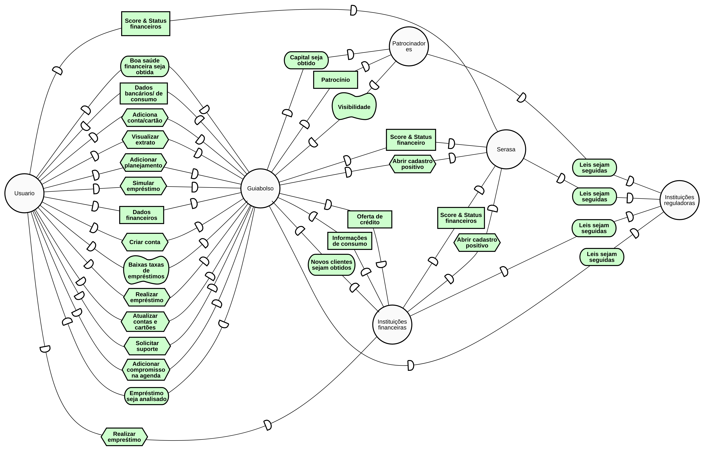

## Introdução 

O Framework i* propõe uma abordagem orientada a agentes para engenharia de requisitos, centrando-se nas características intencionais do agente. Os agentes atribuem propriedades intencionais (como metas, crenças, habilidades, compromissos) entre si e raciocinam sobre relacionamentos estratégicos. As dependências entre os agentes geram oportunidades e vulnerabilidades. Redes de dependências são analisadas usando uma abordagem de raciocínio qualitativo. Os agentes consideram configurações alternativas de dependências para avaliar seu posicionamento estratégico em um contexto social.

Para a confecção dos I* o grupo optou por utilizar a ferramenta [piStar Tool](https://www.cin.ufpe.br/~jhcp/pistar/)

Obs.: Todas as imagens podem ser ampliadas ao se clicar nelas.

## Strategic Dependency Model (SD)

### IS01 - Atores

| **IS01** | **Atores**|
|--|--|
| **Versão**| Atual: 1.0 (26/05)   Anterior: --|
| **Rastreabilidade** | [Casos de uso](../casos_de_uso) |

## Strategic Rationale Model (SR)

### IS02 - Adicionar contas e cartões

| **IS02** | **Adicionar contas e cartões**|
|--|--|
| **Versão**| Atual: 1.0 (26/05)   Anterior: --|
| **Rastreabilidade** | [Casos de uso](../casos_de_uso) |

### IS03 - Simular empréstimo

| **IS03** | **Simular empréstimo**|
|--|--|
| **Versão**| Atual: 1.0 (26/05)   Anterior: --|
| **Rastreabilidade** | [Casos de uso](../casos_de_uso) |

## Referências 

 - [http://www.cs.toronto.edu/km/istar/#Overview](http://www.cs.toronto.edu/km/istar/#Overview)
